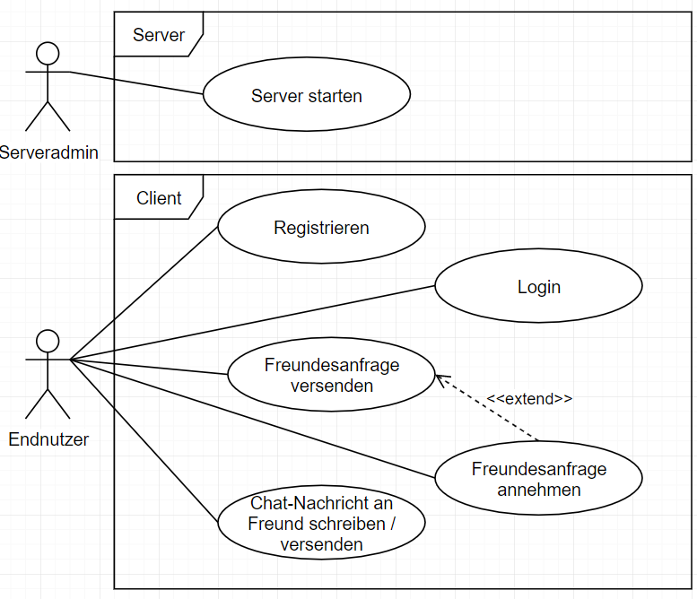
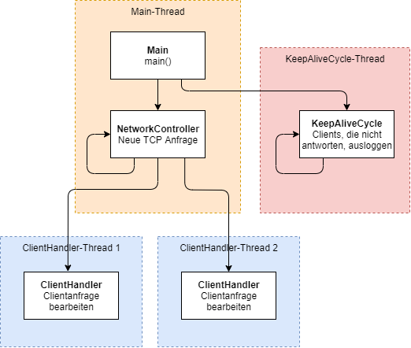
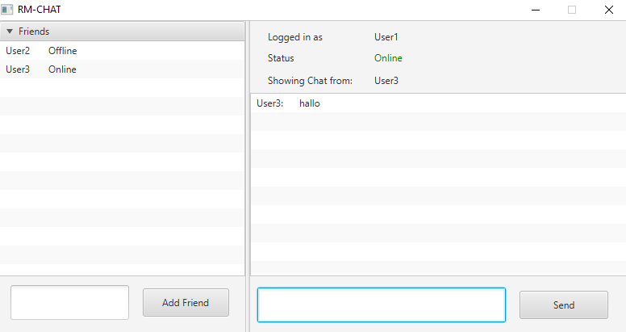
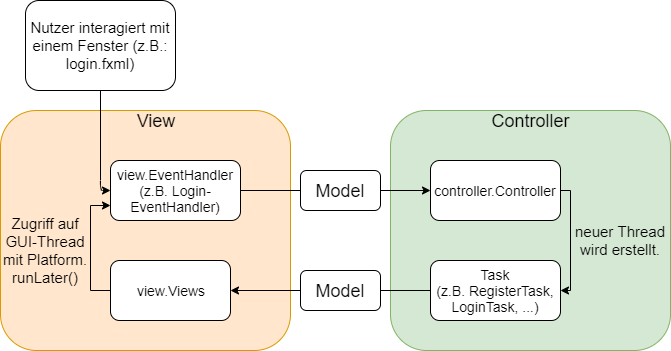
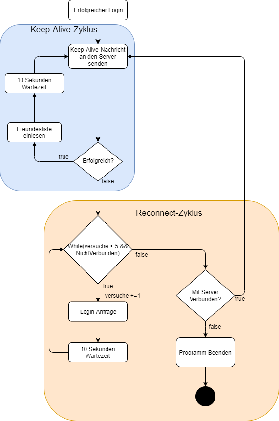
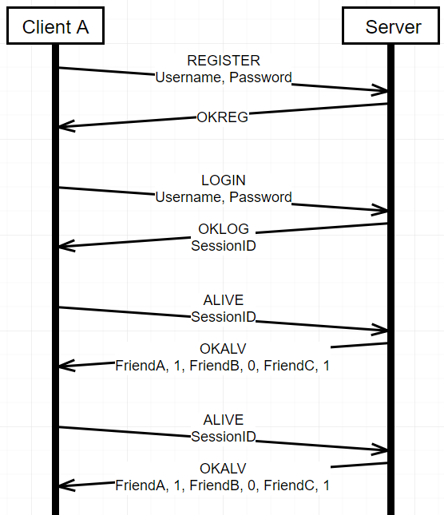
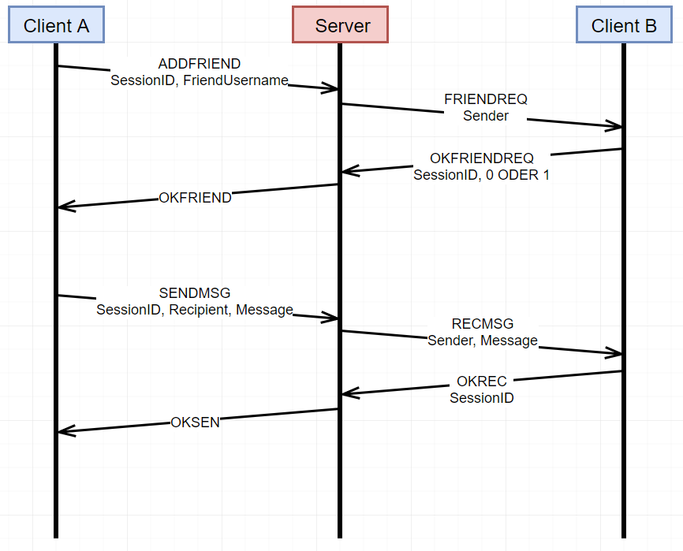
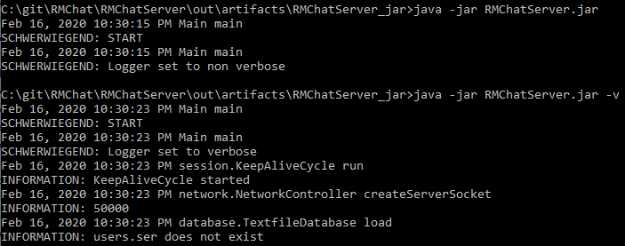
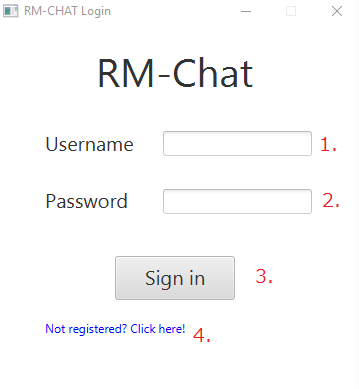
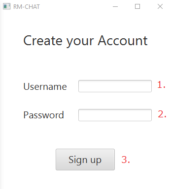

# Einleitung

Im Rahmen der Vorlesung  “Entwicklung Verteilter Anwendungen mit Java” vom Studiengang Angewandte Informatik der Hochschule Kaiserslautern im Wintersemester 2019/20 wurde das Chatprogramm _RMChat_ in Partnerarbeit von Markus Dauth und Raschied Slet entwickelt. Ziel ist es, die in der Vorlesung erlernten Techniken bezüglich der Programmierung von Java-Programmen mit dem Fokus auf Netzwerkkommunikation in einem stabilen und funktionalen Projekt praktisch umzusetzen. 

Das Programm “RMChat” ist eine Applikation, die es Nutzern ermöglicht Chat-Nachrichten an andere Nutzer zu übertragen. Hierfür werden zusätzlich Funktionalitäten wie Registrierung, Login und das Hinzufügen von anderen Nutzern als Freund angeboten.

RMChat ist in zwei Java-Programme aufgeteilt: Client und Server. Endnutzer von RMChat interagieren mit dem Client, während ein Server die Kommunikation zwischen zwei Clients ermöglicht.

Entwickelt wurde RMChat mit Java 8, unterstützt von der IDE _IntelliJ _und dem Versionsverwaltungssystem _Git _mit dem Client _GitHub Desktop_. Es wurde darauf geachtet, dass jegliche Funktionalitäten nur mit den von Java 8 bereitgestellten Packages implementiert sind. Sowohl Marshalling von Netzwerknachrichten, sowie User Sessions wurden komplett eigenständig implementiert.

# Funktionalitäten

Folgendes Use Case Diagramm zeigt die möglichen Funktionalitäten der Nutzer:

## Server

Der Server ist eine reine Konsolenanwendung. Er hat eine feste IP-Adresse (Adresse des Rechners, auf dem die Serveranwendung läuft) und Port (50000), welche dem Client bekannt sind.

Für jede Anfrage, die der Client sendet, wird eine neue TCP-Verbindung geöffnet. Die Klasse _network_._NetworkController _bietet hierfür einen ServerSocket auf dem Port 50000 an. Akzeptiert der Server eine neue TCP-Verbindung, wird ein neuer Thread der Klasse _network.ClientHandler _erstellt, welcher dann die Anfrage bearbeitet. Die Logik für diese Anfragen befindet sich in den Klassen _session.Registration _und _session.SessionHandler_.

Es werden hauptsächlich zwischen vier Funktionalitäten unterschieden, über die ein Client Anfragen an den Server sendet:

*   Registrierung: Ein Client kann einen neuen Nutzer mit Nutzername und Passwort registrieren. Der Nutzer wird auf der Datenbank des Server abgespeichert.
*   Login: Ein Nutzer kann sich mit seinem Nutzernamen und Passwort anmelden. Hier wird eine neue Session mit SessionId auf Serverseite angelegt und diese im weiteren Verlauf verwaltet. Beim Login wird zusätzlich der zufällig gewählte Port eines ServerSockets des Clients übertragen, damit der Server auch Anfragen den Client schicken kann.
*   Freundesliste: Der Client hat eine Freundesliste, welche alle Freunde des Nutzers und deren Onlinestatus anzeigt. Ein Nutzer kann neue Freunde mittels einer Freundesanfrage hinzufügen.
*   Versenden von Chat Nachrichten: Ein Client kann einem Freund, der gerade online ist, eine Chat-Nachricht übermitteln.

Um die Kommunikation dieser Funktionalitäten zwischen Client und Server zu ermöglichen, gibt es ein Nachrichtenprotokoll welche beide Seiten verstehen müssen (Siehe Kapitel Protokoll)

Erhält der Server eine Anfrage zum Login eines Nutzers, so erstellt der Server ein neues Objekt der Klasse _session.UserSession_. Jedes UserSession-Objekt stellt eine aktive online Verbindung eines Clients dar und wird in einem Set in der Klasse _session.SessionHandler_ verwaltet. In einer UserSession werden Daten wie Nutzername, IP-Adresse, Freunde und SessionId gespeichert. 

Nachdem Login muss der Client für alle zukünftigen Anfragen (z.B. neuen Freund hinzufügen, Chatnachricht versenden) seine SessionId übermitteln, damit der Server den Nutzer authentifizieren kann. Der Server authentifiziert Nutzer, indem er die übertragenen SessionIds mit den gespeicherten SessionIds des UserSession-Sets vergleicht. Ist die übertragene SessionId nicht in dem Set vorhanden, so wird die Verarbeitung der Anfrage abgebrochen und der Client erhält eine entsprechende Fehlermeldung als Antwort (Siehe Kapitel Protokoll)

Damit gewährleistet wird, dass der Server den aktuellen Onlinestatus von Nutzern kennt, müssen die Clients in gewissen zeitlichen Abständen (30 Sekunden) dem Server eine Nachricht übermitteln. Erhält der Server in diesem Zeitraum keine Anfrage eines Clients, so erfolgt ein Timeout und die Session wird geschlossen. Clients senden hierfür alle 10 Sekunden eine _KeepAlive_-Message. Der Server schickt bei der Antwort einer KeepAlive-Message zusätzlich noch die Freundesliste des anfragenden Client mit. In der Freundesliste wird für jeden Freund zusätzlich der Onlinestatus mitgeliefert, damit der Client darstellen kann, welche Freunde gerade online sind.

Um zu überprüfen, welche UserSession-Objekte noch online/gültig sind, wird ein zusätzlicher Thread gestartet, welcher in einer Dauerschleife die UserSession-Objekte überprüft. Die Logik hierfür befindet sich in der _session.KeepAliveCycle _Klasse. Es wird überprüft, wann die letzte Nachricht von einem Client erhalten wurde. Wird die Timeout-Zeit überschritten (30 Sekunden), wird das UserSession-Objekt gelöscht und der Nutzer gilt damit als offline. 

Folgende Grafik zeigt den Zusammenhang der erstellten Threads. Gestrichelte Linien repräsentieren Threads, während Klassen fett gedruckt sind. Die Pfeile welche Klassen neue Threads erzeugen.

## Client

Der Client ist eine JavaFX Anwendung. Es gibt 3 Fenster:

*   Ein Fenster um sich zu registrieren.
*   Ein Fenster um sich anzumelden.
*   Ein Fenster um zu chatten und zur Freundesverwaltung.

Für jedes Fenster gibt es eine .fxml Datei: register.fxml, login.fxml, chat.fxml. Um die Erstellung der Fenster zu vereinfachen, wurde das Programm SceneBuilder verwendet.

Das folgende Bild zeigt das Chat-Fenster des Programms.

Der Client wurde nach dem MVC Entwurfsmuster realisiert. Die Idee hierbei ist es, die Logik des Programms in drei Komponenten zu unterteilen: Model, View und Controller. Models werden verwendet, um die Kommunikation zwischen View und Controller zu ermöglichen. Nach der Bearbeitung des Models im Controller wird das Ergebnis als Model an die View gesendet und die View zeigt das Ergebnis dem Nutzer an.

Jedem Fenster ist ein eigener EventHandler zugewiesen (Klassen _LoginEventHandler_, _RegisterEventHandler und_ _ChatEventHandler_). Bei Benutzereingaben im entsprechenden Fenster werden Methoden des entsprechenden EventHandler getriggert wird. 

Findet eine Benutzereingabe statt, wird im EventHandler ein Model erstellt, welches daraufhin dem Controller (Klasse _controller.Controller_) übergeben wird. Jede Funkionalität (z.B. Registrieren, Nachricht versenden) wurde als eigene Klasse realisiert, welche das Interface Runnable implementiert _(LoginTask, RegistrationTask, SendMessageTask_). Der Controller erstellt dann über diese Klassen jeweils einen neuen Thread, welcher jeweils eine Aufgabe bearbeitet. Diese Threads werden im Folgenden “Tasks” genannt. In diesen Tasks  findet unter Anderem die Kommunikation mit dem Server statt.

Sobald ein Task abgeschlossen ist, übergibt er ein Model mit dem Ergebnis an die Klasse _view.Views _zurück. Da die Logik für die grafische Oberfläche (GUI) auf mehrere Klassen aufgeteilt ist, dient die Klasse _Views _als Schnittstelle für den Controller, welche alle Funktionalitäten der EventHandler  bündelt.

Ruft der Controller eine Methode der Klasse _Views_ auf, wird das Model mit Hilfe der Methode Platform.runLater() an den GUI-Thread übergeben, wo anschließend das neue Model in der GUI dargestellt wird.

Die folgende Zeichnung zeigt die Kommunikation zwischen den Klassen und Threads. Die Klassen befinden sich alle in eines der drei Packages “model”, “view” oder “controller”.

Bei erfolgreichem Login werden zusätzlich in zwei neuen Threads der Keep-Alive-Zyklus (_KeepAliveTask_) und der Incoming-Message-Zyklus (_IncomingMessageTask_) gestartet. Der Keep-Alive-Zyklus sendet periodisch Pakete (alle 10 Sekunden) an den Server, um den Status der eigenen UserSession auf Serverseite zu aktualisieren. Der Server gibt neben der Bestätigung der Keep-Alive-Nachricht eine Liste mit den Freunden des Benutzers und deren Status zurück.

Falls beim Senden der Keep-Alive Messages ein Fehler auftritt (z. B. wenn der Server nicht erreichbar ist) wird der Keep-Alive-Zyklus beendet und ein Reconnect-Zyklus gestartet. In diesem werden periodisch (alle 10 Sekunden) für eine fest definierte Anzahl an Versuchen (5) Login-Anfragen an den Server gesendet. Ist der Reconnect erfolgreich, wird zum Keep-Alive-Zyklus gewechselt. Falls der Reconnect nicht erfolgreich ist, wird der Benutzer davon benachrichtigt und die Applikation wird geschlossen. 

Folgendes Flussdiagramm zeigt den Ablauf des Keep-Alive-Zyklus und dem Reconnect-Zyklus.

Beim Incoming-Message-Zyklus werden auf einem zufälligen Port Anfragen vom Server mit einem ServerSocket angenommen. Es werden Anfragen unterstützt, um Nachrichten von Freunden zu empfangen und um andere Benutzer zur Freundesliste hinzufügen (Klasse controller._network.ServerHandler)_.

## Gemeinsame Strukturen von Client und Server

Da Client und Server sich teilweise den gleichen Code teilen, wurde darauf geachtet, dass in beiden Java-Projekten diese Implementierungen identisch sind. Folgende Infrastruktur ist sowohl in Client auch als im Server vorhanden:

**Logger**

Um die Codewartung und das Debugging zu erleichtern, wurde der Standard-Logger von Java_ java.util.logging.Logger _zum Ausgeben von Informationen für Entwickler benutzt. Der Logger ist so konfiguriert, dass Nachrichten in IntelliJ und in der Datei _logs.log_ ausgegeben werden.

**Datenbank**

Sowohl Client als auch Server müssen persistent Informationen speichern können. Der Client speichert erhaltene Chat-Nachrichten und der Server speichert registrierte Nutzer (Nutzername und Passwort) und welcher Nutzer mit wem befreundet ist.

Hierfür wurden im Package _database_ bei Client und Server Interfaces für den Zugang auf die Datenbank erstellt. Da eine SQL-Datenbank für Client und Server in diesem Projekt zu zeitaufwändig gewesen wäre, werden die Informationen mittels Serialisierung von Objekten in lokale ._ser_-Dateien gespeichert. Die Serialisierung erfolgt in den Klassen _FileChatDatabase_ für den Client, bzw. _TextfileDatabase _für den Server. Beide Klassen implementieren jeweils ihr Datenbank-Interface (_ChatDatabaseInterface_ und_ DatabaseInterface_). Die Interfaces ermöglichen einen leichten Austausch der Serialisierungs-Klassen mit Datenbank-Klassen für den möglichen Produktivbetrieb der Anwendung.

**Properties**

In der Datei _config.properties _des Packages _properties_ werden bei Client und Server Konfigurationsoptionen hinterlegt, wie z.B. die minimale und maximale Länge von Nutzernamen und Passwörtern oder die Ports von Client und Server. Über die Singleton-Klasse _Properties_ im gleichen Package können auf diese Konfigurationswerte global zugegriffen werden.

# Netzwerk

Um ein besseres Verständnis über die allgemeine Netzwerkkommunikation von Applikationen  zu erhalten,  wurden alle Funktionalitäten von RMChat mit den grundlegendsten Methoden von Java implementiert. Jegliche Netzwerkkommunikation erfolgt über TCP mit den Java Klassen _ServerSocket _und _Socket_. 

## Protokoll

Sowohl Server als auch Client können sich gegenseitig neue Anfragen senden. Für jede Anfrage wird eine neue TCP-Verbindung aufgebaut. Der Anfragende übermittelt eine Nachricht, die einen _Code _und gegebenenfalls mehrere Parameter enthält. Ein _Code_ gibt an, um was für eine Anfrage es sich handelt. Abhängig von Code sind weitere Parameter in einer festen Reihenfolge vorgegeben. Auf jede Anfrage wird immer genau eine Antwort über die gleiche TCP-Verbindung zurückgesendet. Der Server erlaubt Verbindungen von Clients über den Port 50000, während der Client Anfragen vom Server über einen zufälligen Port des Client (abhängig vom Betriebssystem) entgegennimmt. Beim Aufbau einer neuen TCP-Verbindung von der Seite des Anfragenden kann das Betriebssystem über einen eigenen Port entscheiden. Die Server-Applikation wird im späteren Produktivbetrieb auf einem Rechner mit einer festen IP-Adresse laufen. Diese IP-Adresse ist in der Properties-Datei des Clients hinterlegt.

Es wurde darauf geachtet, dass jegliche Anfragen zwischen zwei Clients immer über den Server übermittelt werden. Dadurch ist gewährleistet, dass keine Clients die IP-Adresse eines anderen Clients auslesen können.

Um den Nachrichtencode und Parameter zu unterscheiden, wird als Trennzeichen der Character ‘\0’ benutzt. Jeder Code und Parameter muss immer mit einem ‘\0’ enden. Beispielsweise könnte eine Anfrage des Clients zum Login (Code: LOGIN) so aussehen: 

LOGIN\0manuel\0p4ssw0rt\0 

Der Server würde dann bei Erfolg darauf mit Code “OKLOG” und einer SessionID antworten:

	OKLOG\0manuel1234\0

Bei Missachtung des Protokolls (z.B. der Client überträgt einen falschen Code) erhält der Anfragende keine Antwort des Gegenüber.

Wird keine Nachricht, die den Erfolg einer Anfrage repräsentiert, erhalten und es entsteht dadurch ein Timeout, so gilt die Anfrage für den Sender als fehlgeschlagen. Der Client zeigt dann dem Nutzer eine entsprechende Fehlermeldung, während der Server alle weiteren Aktionen bezüglich dieser Anfrage verwirft.

Folgende Tabelle beschreibt welche Protokollschnittstellen der Server anbietet (bzw. welche Anfragen ein Client dem Server senden kann). Im Falle eines Fehlers, wird immer der Code “ERROR” benutzt. Bei allen Werten handelt es sich um Strings.

<table>
  <tr>
   <td><strong>Code </strong>
   </td>
   <td><strong>Parameter</strong>
   </td>
   <td colspan="2" ><strong>Erläuterung</strong>
   </td>
   <td><strong>Code und Parameter bei Erfolg</strong>
   </td>
   <td><strong>Mögliche Fehler</strong>
   </td>
  </tr>
  <tr>
   <td>REGISTER
   </td>
   <td>Username, Password
   </td>
   <td colspan="2" >Registrierung neuer Nutzer
   </td>
   <td>OKREG
   </td>
   <td>InvalidUsername,

InvalidPassword,

UsernameTaken
   </td>
  </tr>
  <tr>
   <td>LOGIN
   </td>
   <td>Username, Password,

Server-

Socket
   </td>
   <td colspan="2" >Login bereits registrierter Nutzer
   </td>
   <td>OKLOG, 

SessionID
   </td>
   <td>WrongUsername,

WrongPassword,

AlreadyLoggedIn
   </td>
  </tr>
  <tr>
   <td>ALIVE
   </td>
   <td>SessionId
   </td>
   <td colspan="2" >KeepAlive-Messages der Clients. Der Server antwortet mit einer Liste der Freunde und deren Onlinestatus (1 = online, 0 = offline).

Leerer String kennzeichnet das Ende der Freundesliste
   </td>
   <td>OKALV,

FriendA, 0,

FriendB, 1,

FriendC, 1,

“”
   </td>
   <td>UserNotLoggedIn
   </td>
  </tr>
  <tr>
   <td>SENDMSG
   </td>
   <td>SessionId, Recipient, Message
   </td>
   <td colspan="2" >Übertragen einer Chatnachricht. Der Server leitet die Nachricht weiter an den Empfänger weiter mit “RECMSG”
   </td>
   <td>OKSEN
   </td>
   <td>UserNotLoggedIn,

RecipientNotLoggedIn,

RecipientNotAFriend,

MessageTooShort,

MessageTooLong
   </td>
  </tr>
  <tr>
   <td>ADDFRIEND
   </td>
   <td>SessionId, FriendUsername 
   </td>
   <td colspan="2" >Freundesanfrage. Der Server leitet die Anfrage weiter an den Empfänger weiter mit “FRIENDREQ”
   </td>
   <td>OKFRIEND
   </td>
   <td>UserNotLoggedIn,

FriendDoesNotExist,

AlreadyFriends,

FriendNotOnline
   </td>
  </tr>
</table>

Folgende Tabelle beschreibt welche Protokollschnittstellen der Client anbietet. Es gelten die gleichen Regeln wie beim Server.

<table>
  <tr>
   <td><strong>Code</strong>
   </td>
   <td><strong>Parameter</strong>
   </td>
   <td><strong>Erläuterung</strong>
   </td>
   <td><strong>Antwortcode und Parameter bei Erfolg</strong>
   </td>
   <td><strong>Mögliche Fehler</strong>
   </td>
  </tr>
  <tr>
   <td>RECMSG
   </td>
   <td>Sender, Message
   </td>
   <td>Empfang einer Chatnachricht eines anderen Clients
   </td>
   <td>OKREC, SessionID
   </td>
   <td>UserNotLoggedIn
   </td>
  </tr>
  <tr>
   <td>FRIENDREQ
   </td>
   <td>Sender
   </td>
   <td>Empfang einer Freundesanfrage eines anderen Clients. Der Nutzer kann die Anfrage bestätigen oder ablehnen
   </td>
   <td>OKFRIENDREQ, SessionID, 0 ODER 1

(0 = die Anfrage wurde vom Nutzer abgelehnt,

1 = Anfrage wurde angenommen)
   </td>
   <td>UserNotLoggedIn,

FriendRequestDenied
   </td>
  </tr>
</table>

## Ablaufdiagramme

Folgendes Ablaufdiagramm zeigt welche Nachrichten bei Registrierung, Login und KeepAlives-Messages übertragen werden.

Folgendes Ablaufdiagramm zeigt, wie die Kommunikation zwischen zwei Clients bei Freundesanfragen und dem Versenden von Chat-Nachrichten abläuft.

## Marshalling

Das Marshalling ist in der Klasse _controller.network.tcp.TcpSend _implementiert. Initialisiert wird diese Klasse mit dem OutputStream des Sockets. Es werden nur Strings versendet. In der Klasse TcpSend wird ein Byte-Buffer verwendet, in dem zu sendene Strings nacheinander eingefügt werden können. Der Byte-Buffer is als primitives Byte-Array implementiert. So kann man Beispielsweise den Code “LOGIN” mit tcpSend._add_(“LOGIN”) dem Buffer hinzufügen.

Es wird von den übergebenen Strings mit hilfe von charAt(i) jeweils ein Zeichen genommen, dieses zu einem Byte gecastet und zum Byte-Buffer geschrieben. Zusätzlich wird nach jedem String das Trennzeichen ‘\0’ hinzugefügt. Man kann beliebig viele Strings mit der add-Methode in den Byte-Buffer schreiben. Wenn alle zu sendenden Parameter dem tcpSend-Objekt hinzugefügt wurden, kann man mit der Methode tcpSend._send() _die TCP-Nachricht an den Empfänger senden. Als Encoding wird die Standard Codierung von Characters in Java verwendet.

Das Unmarshalling wird von der Klasse _controller.network.tcp.TcpReceive _übernommen. Initialisiert wird ein Objekt dieser Klasse mit dem InputStream des Sockets.

In der Methode _receive _werden die vom OutputStream empfangenen Daten in einen Byte-Buffer der TcpReceive-Klasse eingefügt. Aus diesem Byte-Buffer kann man einzelne Strings bis zu einem ‘\0’ mit der Methode _tcpReceive_._readNextString_() auslesen. Dafür wandelt die Methode readNextString() einzelne Bytes in Characters um, welche durch einen StringBuilder Zeichen für Zeichen in einen String zusammengebaut werden und diesen als Rückgabewert zurückgeben. Für jeden Parameter der übertragenen Nachricht (getrennt durch ‘\0’), muss die Methode readNextString() einmal aufgerufen werden.

# Durchgeführte Tests

Folgende Tabelle beschreibt die getesteten Fälle. Es wurde getestet, wie sich jeweils Server und Client verhalten, wenn die andere Komponente offline ist. Dies wurde simuliert, indem zu den gegebenen Zeitfenstern die Internetverbindung getrennt wurde. Als “offline” wird jeweils die Komponente bezeichnet, für die der Ausfall simuliert wurde und als “online” wird die Komponente bezeichnet, welche korrekt läuft und auf eine Netzwerknachricht wartet.

Als “erfolgreich” gilt ein Test, wenn die jeweilige Komponente auf die simulierte Testbedingung erfolgreich simuliert, sprich die Komponente stürzt nicht ab und gibt ggf. eine entsprechende Fehlermeldung aus.

<table>
  <tr>
   <td><strong>Testfall</strong>
   </td>
   <td><strong>Client A</strong>
   </td>
   <td><strong>Client B</strong>
   </td>
   <td><strong>Server</strong>
   </td>
  </tr>
  <tr>
   <td>Client A will Client B als Freund hinzufügen
   </td>
   <td>Erfolgreich
   </td>
   <td>Online
   </td>
   <td>Online
   </td>
  </tr>
  <tr>
   <td>Client A will Client B als Freund hinzufügen
   </td>
   <td>Erfolgreich
   </td>
   <td>Offline
   </td>
   <td>Online
   </td>
  </tr>
  <tr>
   <td>Client A will Client B als Freund hinzufügen
   </td>
   <td>Erfolgreich
   </td>
   <td>Online
   </td>
   <td>Offline
   </td>
  </tr>
  <tr>
   <td>Client A schickt Client eine Nachricht an Client B
   </td>
   <td>Erfolgreich
   </td>
   <td>Online
   </td>
   <td>Online
   </td>
  </tr>
  <tr>
   <td>Client A schickt Client eine Nachricht an Client B
   </td>
   <td>Erfolgreich
   </td>
   <td>Online
   </td>
   <td>Offline
   </td>
  </tr>
  <tr>
   <td>Client A schickt Client eine Nachricht an Client B
   </td>
   <td>Erfolgreich
   </td>
   <td>Offline
   </td>
   <td>Online
   </td>
  </tr>
  <tr>
   <td>Reconnect-Zyklus (Server war offline)
   </td>
   <td>Erfolgreich
   </td>
   <td>-
   </td>
   <td>Offline
   </td>
  </tr>
  <tr>
   <td>Reconnect-Zyklus (Client war offline)
   </td>
   <td>Erfolgreich
   </td>
   <td>-
   </td>
   <td>Online
   </td>
  </tr>
  <tr>
   <td>Registrierung (Server offline)
   </td>
   <td>Erfolgreich
   </td>
   <td>-
   </td>
   <td>Offline
   </td>
  </tr>
  <tr>
   <td>Registrierung (Client offline)
   </td>
   <td>Erfolgreich
   </td>
   <td>-
   </td>
   <td>Online
   </td>
  </tr>
  <tr>
   <td>Login (Server offline)
   </td>
   <td>Erfolgreich
   </td>
   <td>-
   </td>
   <td>Offline
   </td>
  </tr>
  <tr>
   <td>Login (Client offline)
   </td>
   <td>Erfolgreich
   </td>
   <td>-
   </td>
   <td>Online
   </td>
  </tr>
</table>

# Zusammenfassung

Die Java Applikation RMChat ist eine einfach zu bedienende, stabile Chat-Applikation. Zu den Funktionalitäten für Endnutzer gehören Registrierung neuer Accounts, Logins, eine Freundesliste und das Versenden von Nachrichten.

Während der Entwicklung wurde darauf geachtet, dass sowohl Client und Server nicht abstürzen können und der produzierte Code leicht verständlich und wartbar ist.

Für die Netzwerkkommunikation wurden eigene Marshalling- und Session-Klassen implementiert, wodurch die Anwendung - sofern es Java zulässt - von Grund auf selbst designed und programmiert wurde. Zusätzlich wurde ein eigenes Kommunikationsprotokoll für das Client-Server-Modell mittels TCP implementiert. Der Server dient als Mittelsmann zwischen der Kommunikation zweier Clients. Die Clients bieten eine grafische Oberfläche mit Hilfe von JavaFX und MVC an. 

Vor der Produktivnahme von RMChat müssten noch sichere SessionIDs generiert und jegliche Netzwerkkommunikation verschlüsselt werden. Zudem sollte das Speichern durch Serialisierung mit einer Datenbank ersetzt und Passwörter nach aktuellen Sicherheitsstandards verschlüsselt gespeichert werden.

Sonstige Erweiterungsmöglichkeiten wäre das Löschen von Freunden, oder das Verknüpfen von Accounts an E-Mail-Adressen um z.B. Funktionen zum Passwort Zurücksetzen anzubieten. 

# 

# Bedienungsanleitung Server

Der Server ist eine reine Konsolenanwendung, die sich über eine .jar-Datei starten lässt. Beim Start kann hierbei das Argument “-v” (kurz für verbose”) angegeben werden, wodurch mehr Informationen auf der Konsole ausgegeben werden. Neben der Ausgabe von der Konsole, loggt der Server aufgetretene Events in eine Log-Datei (logs.log), die sich im gleichen Verzeichnis wie die .jar-Datei befindet.

Folgendes Bild zeigt einmal den Start des Server mit dem Argument -v und einmal ohne Argumente.

Der Server speichert Informationen über die Nutzer (z.B. Loginname, Passwort, Freunde) in der Datei “users.ser” ab, welche als Datenbank dient. Ist diese Datei nicht vorhanden, wird diese beim ersten Speichern eines Nutzer angelegt.

# Bedienungsanleitung Client

RMChat ist eine Chat-Applikation für das Versenden von Nachrichten zwischen Freunden. Endnutzer können durch Clients von RMChat Nachrichten an andere Nutzer versenden. Die Kommunikation von Clients erfolgt über einen Server.

Im Folgenden werden die Funktionalitäten des Clients erläutert. 

## Login

Zu Programmstart wird das Login Fenster angezeigt:

Falls noch kein Account erstellt wurde, muss 4. ausgewählt werden, wodurch sich das Registrierungsfenster öffnet.

Ansonsten muss in 1. der Nutzername und in 2. das Passwort eingegeben werden. Sobald dies erledigt ist wird durch betätigen von 4. die Logindaten vom Server überprüft. Sind die Logindaten korrekt, öffnet sich das Chatfenster.

## Registrierung

In 1. muss der gewünschte Nutzername und in 2. das Passwort eingegeben werden. Der Nutzername und das Passwort müssen mindestens 4 Zeichen lang sein. Durch das Klicken auf 3. werden die Eingaben bestätigt und an den Server gesendet.

Bei erfolgreicher Registrierung kann das Fenster geschlossen werden und man kann sich nun einloggen.

## Chatfenster

### Status

Bei 1. ist der Nutzername und der Status sichtbar. Bei Verbindungsproblemen zum Server wird angezeigt dass der Client Offline ist und dass Verbindungsversuche zum Server gestartet werden. Zusätzlich wird mit welchem Freund der Nutzer chattet.

### Freundesanfragen

Bei 2. Befindet sich die Freundesliste. Es werden Freunde und deren aktueller Onlinestatus aufgelistet.

Durch betätigen von 4. wird eine Freundesanfrage an einen anderen Account gesendet, welcher unter 3. angegeben wird.

### Nachrichten senden

Um eine Nachricht versenden zu können muss in der Freundesliste (2.) ein Freund angeklickt werden. Anschließend öffnet sich bei 7. die Chat-Historie. Das Eingabefeld unter 5. dient zum Schreiben von Chatnachrichten, welche durch betätigen von 6. versendet werden kann. Die zu sendende Nachricht darf jedoch nicht mehr als 500 Zeichen groß sein.
